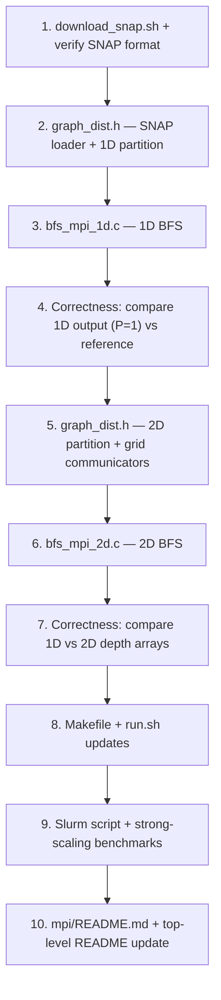

# MPI-Distributed BFS Extension (CPU-only)

Add two pure MPI (CPU-only, no CUDA) BFS implementations that partition the graph across processes using different strategies — **1D vertex partitioning** and **2D edge partitioning** — benchmarked on real-world Stanford SNAP road networks.

> [!NOTE]
> This MPI layer is deliberately CPU-only and lives in a separate `mpi/` directory. The existing single-GPU implementations in `graph-first/` and `linear-algebraic/` are untouched.

---

## Datasets: Stanford SNAP Road Networks

Replace the synthetic test graphs with three real-world road networks from the Stanford Network Analysis Project (SNAP). These are undirected graphs where nodes are road intersections/endpoints and edges are roads.

| Dataset | Vertices | Edges (undirected) | Avg Degree | Download |
|---|---:|---:|---:|---|
| `roadNet-PA` | 1,088,092 | 1,541,898 | ~2.8 | https://snap.stanford.edu/data/roadNet-PA.txt.gz |
| `roadNet-TX` | 1,379,917 | 1,921,660 | ~2.8 | https://snap.stanford.edu/data/roadNet-TX.txt.gz |
| `roadNet-CA` | 1,965,206 | 2,766,607 | ~2.8 | https://snap.stanford.edu/data/roadNet-CA.txt.gz |

**Why road networks?**
- Real-world, not synthetic
- Sparse and high-diameter (good stress test for BFS depth and many levels of communication)
- All ~1–2M vertices — large enough to justify distributed memory
- SNAP format is tab-separated edgelist with `#` comment lines — easy to parse

**Download script** (`scripts/download_snap.sh`):
```bash
wget https://snap.stanford.edu/data/roadNet-PA.txt.gz -P snap-graphs/
wget https://snap.stanford.edu/data/roadNet-TX.txt.gz -P snap-graphs/
wget https://snap.stanford.edu/data/roadNet-CA.txt.gz -P snap-graphs/
gunzip snap-graphs/*.gz
```
The SNAP format has `# FromNodeId  ToNodeId` header comments and then `src\tdst` lines — the loader needs to handle tab-separated input and skip `#` lines (slightly different from the existing `.edgelist` format).

---

## Two MPI Partitioning Strategies

### Strategy 1: 1D Vertex Partitioning

```
Vertices: 0 ─────────────────── V-1
          ├── Rank 0 ──┤── Rank 1 ──┤── Rank 2 ──┤
          [0 .. V/P-1]  [V/P..2V/P]  [2V/P..V-1]
```

- **Each rank owns a contiguous block of vertices** (rows of the adjacency matrix)
- Each rank stores a local CSR for its rows only; column indices remain global IDs
- Edges that cross partition boundaries are **ghost edges** — they reference vertices owned by other ranks
- **Per BFS level**:
  1. Each rank discovers new vertices within its local partition
  2. `MPI_Allgather` the local `new_frontier` bitmask (compact, ~V/8 bytes total) so all ranks have the global frontier for the next level
  3. Check `MPI_Allreduce(found_new)` to decide whether to terminate
- **Pros**: Simple, low memory overhead, easy to implement
- **Cons**: Load imbalance if vertex degrees are skewed; high-diameter graphs (like roads) mean many BFS levels → many `Allgather` calls

**Frontier exchange cost per level**: `O(V/8)` bytes broadcast — for roadNet-CA (~2M vertices) that's ~256 KB per level × ~1000 levels ≈ manageable.

### Strategy 2: 2D Edge Partitioning

```
         Columns (source owners):
         Rank 0   Rank 1   Rank 2
Rows   ┌────────┬────────┬────────┐
(dest) │ Block  │ Block  │ Block  │  ← Rank 0
owners ├────────┼────────┼────────┤
       │ Block  │ Block  │ Block  │  ← Rank 1
       ├────────┼────────┼────────┤
       │ Block  │ Block  │ Block  │  ← Rank 2
       └────────┴────────┴────────┘
```

- Arrange P ranks in a **√P × √P process grid** (e.g., 4 ranks → 2×2 grid)
- The adjacency matrix is split into `√P × √P` blocks; rank `(r, c)` owns the submatrix block at row-block `r`, column-block `c`
- **Per BFS level**:
  1. **Column broadcast**: Each rank shares the frontier bits of its column-block's vertices along its process column using `MPI_Bcast` (within a column communicator)
  2. **Local SpMV**: Each rank computes its submatrix's contribution to the next frontier
  3. **Row reduction**: Each rank ORs results along its process row using `MPI_Reduce`/`MPI_Allreduce` within a row communicator
- **Pros**: Better communication scalability — each rank only communicates with `O(√P)` neighbors instead of all P; total communication volume is the same but latency scales better at high P
- **Cons**: More complex setup (grid communicators, submatrix partitioning); requires P to be a perfect square (or adjust to rectangular grid)

**When 2D wins**: At high rank counts (16+ ranks), the 1D strategy requires every rank to talk to every other rank (`MPI_Allgather` is O(P) messages), whereas 2D only needs O(√P) messages per rank.

---

## Proposed Changes

### New `mpi/` Directory

```
mpi/
├── README.md
├── graph_dist.h          # Distributed graph loader (SNAP format + partitioning)
├── bfs_mpi_1d.c          # 1D vertex-partitioned BFS
└── bfs_mpi_2d.c          # 2D edge-partitioned BFS
```

#### [NEW] `mpi/graph_dist.h`

Shared C header:

```c
typedef struct {
    int    global_V;        // total vertices
    int    global_E;        // total directed edges
    int    local_V;         // vertices owned by this rank (1D only)
    int    v_start, v_end;  // [v_start, v_end) global vertex range owned
    int   *row_ptr;         // local CSR row pointers (size local_V + 1)
    int   *col_idx;         // local CSR col indices (global vertex IDs)
    int    local_E;         // number of local edges
} DistGraph1D;

// Load SNAP .txt format (tab-sep, # comments)
int load_snap_1d(const char *file, DistGraph1D *g, int rank, int nprocs);

// 2D variant uses a different struct (block row/col ranges)
```

Key detail: SNAP files use tab-separated `FromNodeId\tToNodeId` and may have non-contiguous vertex IDs → the loader must renumber vertices `0..V-1` using a sort+remap pass done identically on all ranks.

#### [NEW] `mpi/bfs_mpi_1d.c`

Pure C + MPI implementation:
- Standard BFS loop with `MPI_Allgather` of the frontier bitmap each level
- Outputs: depth array gathered to rank 0, timing via `MPI_Wtime()`
- CLI: `mpirun -np P ./build/bfs_mpi_1d <graph.txt> <source>`

#### [NEW] `mpi/bfs_mpi_2d.c`

Pure C + MPI implementation:
- Sets up a 2D Cartesian communicator: `MPI_Cart_create()`
- Creates row and column sub-communicators: `MPI_Comm_split()`
- Per-level: column `Bcast` of frontier slice → local scan → row `Allreduce` of new frontier
- CLI: `mpirun -np P ./build/bfs_mpi_2d <graph.txt> <source>` (requires P = perfect square)

---

### Build System

#### [MODIFY] `Makefile`

```makefile
MPICC    = mpicc
MPIFLAGS = -O2 -Wall

MPI_1D = $(BUILD_DIR)/bfs_mpi_1d
MPI_2D = $(BUILD_DIR)/bfs_mpi_2d

mpi: $(BUILD_DIR) mpi-1d mpi-2d

mpi-1d: $(BUILD_DIR)
	$(MPICC) $(MPIFLAGS) -o $(MPI_1D) mpi/bfs_mpi_1d.c -lm

mpi-2d: $(BUILD_DIR)
	$(MPICC) $(MPIFLAGS) -o $(MPI_2D) mpi/bfs_mpi_2d.c -lm
```

On Perlmutter with `PrgEnv-gnu` loaded, `mpicc` wraps `gcc` with Cray MPI automatically.

---

### Scripts & Infrastructure

#### [NEW] `scripts/download_snap.sh`

Downloads and unzips all three SNAP road networks into `snap-graphs/`.

#### [NEW] `scripts/perlmutter_mpi_bench.slurm`

Multi-node CPU-only Slurm script:
```bash
#SBATCH -C cpu          # CPU nodes only
#SBATCH -q regular
#SBATCH -N 4
#SBATCH --ntasks=64     # 16 MPI ranks per node
#SBATCH -t 00:30:00
```
Runs strong-scaling sweep: 1, 2, 4, 8, 16, 32, 64 ranks on all three graphs.

#### [MODIFY] `run.sh`

Add:
- `./run.sh mpi-build` — builds MPI binaries
- `./run.sh mpi-test NP` — runs MPI BFS with `NP` ranks on the SNAP graphs
- `./run.sh mpi-validate NP` — dumps depths, compares 1D vs 2D output (must match)

---

## Implementation Order



---

## Verification Plan

### Correctness

1. **Serial check**: Run 1D BFS with `-np 1` and compare against the existing `validate_bfs.py` Python reference
2. **Rank-count invariance**: Run 1D with 1, 2, 4, 8 ranks — depths must be identical
3. **1D vs 2D agreement**: Depths from both implementations must match exactly for all rank counts

### Performance

Strong-scaling experiment on `roadNet-CA` (largest graph):

| Ranks | 1D time (s) | 2D time (s) |
|---|---|---|
| 1  | baseline | baseline |
| 2  | ~2× faster? | ~2× faster? |
| 4  | ? | ? |
| 8  | ? | ? |
| 16 | ? | ? |
| 32 | 1D comm overhead grows | 2D should be better |

Expected: 1D beats 2D at low rank counts (simpler), 2D catches up or beats 1D at high rank counts due to reduced all-to-all communication volume.

---

## Final Project Structure

```
parallel-bfs/
├── Makefile                          (modified: +mpi targets)
├── run.sh                            (modified: +mpi commands)
├── README.md                         (modified: +mpi section)
├── MPI_IMPLEMENTATION_PLAN.md        (this file)
├── mpi/                              (NEW)
│   ├── README.md
│   ├── graph_dist.h                  (SNAP loader + 1D/2D partition)
│   ├── bfs_mpi_1d.c                  (1D vertex-partitioned MPI BFS)
│   └── bfs_mpi_2d.c                  (2D edge-partitioned MPI BFS)
├── snap-graphs/                      (NEW — gitignored, downloaded separately)
│   ├── roadNet-PA.txt
│   ├── roadNet-TX.txt
│   └── roadNet-CA.txt
├── scripts/
│   ├── download_snap.sh              (NEW)
│   ├── perlmutter_mpi_bench.slurm   (NEW)
│   ├── benchmark.py                  (unchanged)
│   └── perlmutter_bench.slurm        (unchanged)
├── linear-algebraic/                 (unchanged)
├── graph-first/                      (unchanged)
└── test-graphs/                      (unchanged)
```

> [!NOTE]
> `snap-graphs/` should be added to `.gitignore` since the files are large (~50–150 MB compressed).

---

## References

- Leskovec, J., Lang, K., Dasgupta, A., Mahoney, M. *Community Structure in Large Networks.* Internet Mathematics 6(1), 2009. (SNAP road network source)
- Buluc, A. & Gilbert, J. *The Combinatorial BLAS: Design, Implementation, and Applications.* IJHPCA 2011. (2D partitioning for sparse graph computations)
- Beamer, S., Asanović, K., Patterson, D. *Direction-Optimizing BFS.* SC12. (existing project foundation)
